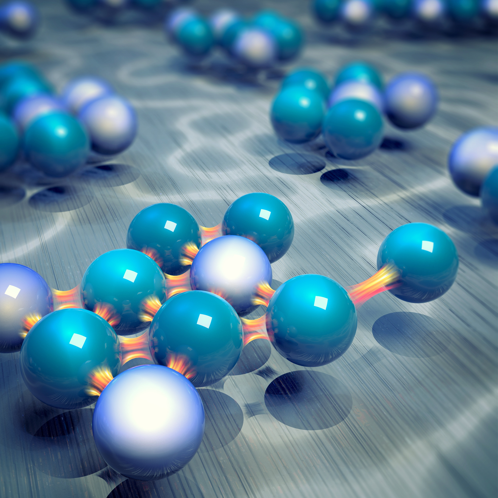

# asymm

Simulation files and code used to analyse the experimental and simulated data in our study Wang, S., Walker-Gibbons, R., Watkins, B. et al. A charge-dependent long-ranged force drives tailored assembly of matter in solution. Nat. Nanotechnol. 19, 485–493 (2024). https://doi.org/10.1038/s41565-024-01621-5

